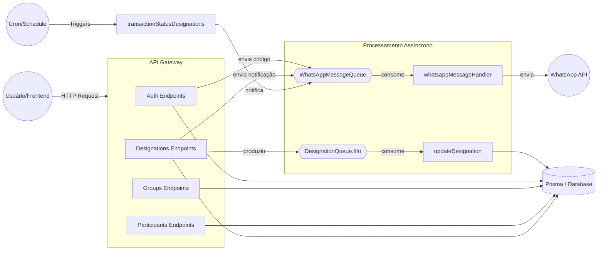
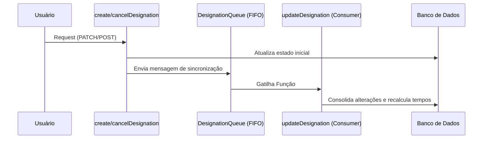
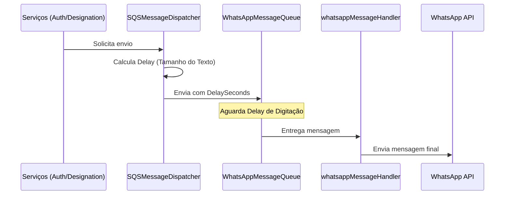

# Arquitetura do Sistema

Esta seção apresenta a visualização técnica da infraestrutura e dos fluxos de dados utilizando Mermaid.js.

## Visão Geral de Componentes

## Fluxos Críticos

### 1. Atualização e Sincronização de Designação
Quando uma alteração é feita (ex: cancelamento ou troca de participante), o sistema garante a consistência através de uma fila FIFO.

### 2. Notificações WhatsApp (Cadência Humana)
O sistema utiliza uma fila para garantir que as mensagens não sejam enviadas todas de uma vez, simulando um comportamento humano de digitação para evitar bloqueios.

